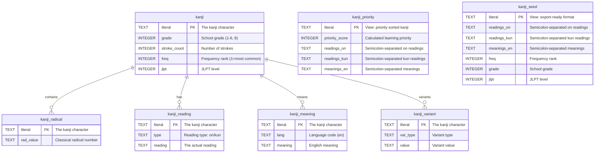

# KANJIDIC2 to SQLite Converter

A fast, memory-efficient tool for converting KANJIDIC2 XML data into a normalized SQLite database. Built with streaming XML parsing and batch processing for optimal performance.


## Features

- **Memory Efficient**: Uses streaming XML parsing (`iterparse`) to handle large KANJIDIC2 files without loading everything into memory
- **Fast Processing**: Batch commits and optimized database schema for maximum performance
- **Normalized Schema**: Clean, normalized database structure for flexible querying
- **Data Quality**: Automatic deduplication and unique indexes prevent duplicate data
- **Foundation-First**: Provides solid database foundation for any kanji application
- **Export Support**: Basic CSV/JSON export for development and prototyping
- **Production Artifacts**: Generate complete packages with seed files, lookup maps, and manifest
- **Automated CI/CD**: GitHub Actions pipeline with comprehensive artifact generation and testing
- **Utility Scripts**: Schema documentation, specialized lookups, MCQ generation, and manifest tools

## Quick Start

```bash
# 1. Create virtual environment and install
python -m venv .venv
source .venv/bin/activate  # On Windows: .venv\Scripts\activate
pip install -e .

# 2. Convert KANJIDIC2.xml to SQLite (using included data file)
k2sqlite build --input data/kanjidic2.xml --db output/kanjidic2.sqlite
```

## Download Pre-built Database

Instead of building the database yourself, you can download a pre-built SQLite database from our GitHub releases or CI artifacts:

### From GitHub Releases
1. Go to the [Releases page](https://github.com/trygu/kanjidic2-sqlite-builder/releases)
2. Download `kanjidic2.sqlite` from the latest release
3. **NEW**: Also available - `kanjidic2-artifacts.tar.gz` containing the complete production package

### From CI Artifacts (Latest Build)
1. Go to [Actions](https://github.com/trygu/kanjidic2-sqlite-builder/actions)
2. Click on the latest successful build
3. Download artifacts:
   - `kanjidic2-sqlite-*` - Just the SQLite database
   - `kanjidic2-artifacts-*` - Complete production package with seed files, lookup maps, and manifest

The database is automatically rebuilt whenever changes are made to the codebase.

## Database Schema

The generated SQLite database contains the following tables:



### Core Tables
- **`kanji`** - Main kanji information
  - `literal` (PRIMARY KEY) - The kanji character
  - `grade` - School grade level (1-6 for elementary, 8 for secondary)
  - `stroke_count` - Number of strokes
  - `freq` - Frequency ranking (1 = most common)
  - `jlpt` - Japanese Language Proficiency Test level

- **`kanji_radical`** - Radical information
  - `literal` - The kanji character
  - `rad_value` - Classical radical number

- **`kanji_reading`** - Pronunciation readings
  - `literal` - The kanji character
  - `type` - Reading type (`'on'` or `'kun'`)
  - `reading` - The actual reading

- **`kanji_meaning`** - English meanings
  - `literal` - The kanji character
  - `lang` - Language code (defaults to `'en'`)
  - `meaning` - English meaning

- **`kanji_variant`** - Character variants
  - `literal` - The kanji character
  - `var_type` - Variant type
  - `value` - Variant value

### Indexes
- `idx_kanji_freq` - Frequency-based lookups
- `idx_reading` - Reading-based searches
- `idx_meaning` - Meaning-based searches
- **Unique indexes** prevent duplicates:
  - `ux_reading` - (literal, type, reading)
  - `ux_meaning` - (literal, meaning)
  - `ux_radical` - (literal, rad_value)
  - `ux_variant` - (literal, var_type, value)

### Essential Views

- **`kanji_priority`** - **Intelligent learning order**
  - **Purpose**: Kanji ranked by optimal learning sequence (frequency → grade → JLPT)
  - **Key field**: `priority_score` (lower = higher priority)
  - **Best for**: Apps that need "what should I learn next?" logic

- **`kanji_seed`** - **Development-friendly format**
  - **Purpose**: Complete kanji info in one row with concatenated readings/meanings
  - **Format**: Semicolon-separated strings, no JOINs required
  - **Best for**: Rapid prototyping, mobile app data loading, CSV exports## Command Line Usage

### Build Database
```bash
# Using included KANJIDIC2 data
k2sqlite build --input data/kanjidic2.xml --db output/kanjidic2.sqlite --batch 500

# Using your own KANJIDIC2 file
k2sqlite build --input /path/to/your/KANJIDIC2.xml --db output/kanjidic2.sqlite --batch 500
```

Build Options:
- `--input`, `-i` - Path to KANJIDIC2.xml file (required)
  - Use `data/kanjidic2.xml` for the included dataset
  - Or provide your own KANJIDIC2.xml file path
- `--db`, `-o` - Output SQLite database path (required)
- `--batch`, `-b` - Number of kanji to process before committing to database (default: 500)
  - Higher values (1000+): Faster processing, more memory usage
  - Lower values (100-250): Slower processing, less memory usage, more frequent saves

### Export Data
```bash
# Basic CSV export
k2sqlite export --db output/kanjidic2.sqlite --view kanji_seed --format csv --limit 100 --output kanji.csv

# Basic JSON export
k2sqlite export --db output/kanjidic2.sqlite --view kanji_priority --format json --limit 50 --output priority.json

# Stream to stdout for further processing
k2sqlite export --db output/kanjidic2.sqlite --view kanji_seed --format csv | head -20
```

**Philosophy**: The export function provides basic data access. Your applications should implement their own specialized logic for:
- Quiz question generation
- Learning algorithms
- UI-specific data formatting
- Caching and performance optimization

Export Options:
- `--db`, `-d` - SQLite database path (required)
- `--view`, `-v` - View to export: `kanji_seed` or `kanji_priority` (default: kanji_seed)
- `--format`, `-f` - Output format: `csv` or `json` (default: csv)
- `--output`, `-o` - Output file path (default: stdout)
- `--limit`, `-l` - Limit number of records exported

### Generate Production Artifacts

The artifacts command generates a complete package of production-ready files for distribution:

```bash
# Generate all artifacts with default 200 kanji seed files
k2sqlite artifacts --db output/kanjidic2.sqlite --output-dir dist/

# Generate artifacts with custom seed limit and version
k2sqlite artifacts --db output/kanjidic2.sqlite --output-dir releases/v1.0 --seed-limit 500 --version "v1.0.0"
```

**Generated Files**:
- `kanjidic2.sqlite` - Complete database copy
- `kanji_seed.csv` - Top N kanji by frequency (CSV format)
- `kanji_seed.json` - Top N kanji by frequency (JSON format)
- `map_char_to_meaning.json` - Character → meanings lookup map
- `map_char_to_readings.json` - Character → readings lookup map
- `manifest.json` - File inventory with SHA256 checksums

Artifacts Options:
- `--db`, `-d` - SQLite database path (required)
- `--output-dir`, `-o` - Output directory (default: artifacts/)
- `--seed-limit`, `-l` - Number of kanji in seed files (default: 200)
- `--version`, `-v` - Version string for manifest (default: local-build)

### MCQ Generator (Bonus Tool)

Generate multiple-choice quiz questions from the database using the included script:

```bash
# Generate 50 questions of each type using top 500 kanji
python scripts/generate_mcq.py --db output/kanjidic2.sqlite --count 50 --output quiz_data --kanji-limit 500
```

**Generated Question Types**:
- Meaning → Character ("What kanji means 'water'?")
- Character → Meaning ("What does 水 mean?")
- Character → Kun Reading ("How do you read 水 (kun)?")
- Character → On Reading ("How do you read 水 (on)?")

**Output Files**:
- `all_questions.json` - All questions combined
- `meaning_to_char.json` - Meaning to character questions
- `char_to_meaning.json` - Character to meaning questions
- `kun_readings.json` - Kun reading questions
- `on_readings.json` - On reading questions

## Utility Scripts

The `scripts/` directory contains additional tools for specialized data generation and analysis:

### Schema Documentation Generator
Generate comprehensive database schema documentation:

```bash
python scripts/generate_schema_docs.py --db output/kanjidic2.sqlite --output docs/
```

**Generated Files**:
- `DATABASE_SCHEMA.md` - Complete schema documentation with sample data
- `SQL_EXAMPLES.md` - Practical SQL query examples with results
- `schema.json` - Machine-readable schema definition

### Specialized Lookup Generator
Create targeted datasets for specific use cases:

```bash
# Generate all lookup categories
python scripts/generate_lookups.py --db output/kanjidic2.sqlite --output lookups/

# Generate only specific categories
python scripts/generate_lookups.py --db output/kanjidic2.sqlite --categories grades jlpt
```

**Generated Categories**:
- `grades/` - Kanji by school grade levels (1-6)
- `jlpt/` - Kanji by JLPT levels (N5-N1)
- `frequency/` - Kanji by frequency rankings (top 100, 500, 1000, 2000)
- `readings/` - Kanji grouped by reading patterns

### Manifest Generator
Create detailed file manifests with checksums and metadata:

```bash
# Basic manifest
python scripts/generate_manifest.py --dir artifacts/ --version "v1.0.0"

# Include SHA256 checksums and API manifest
python scripts/generate_manifest.py --dir artifacts/ --include-checksums --api-manifest
```

**Generated Files**:
- `manifest.json` - Complete file inventory with metadata and optional checksums
- `api_manifest.json` - API-focused manifest for web services

## Automated Builds

This project uses GitHub Actions to automatically build and test the SQLite database with full production artifacts:

- **On every push/PR**: Database is built, tested, and production artifacts generated
- **On releases**: Database and complete artifact package attached to GitHub releases
- **Manual triggers**: You can manually trigger builds from the Actions tab

### CI/CD Features:
- ✅ **Automated Testing**: Runs full test suite
- ✅ **Database Validation**: Verifies row counts and data integrity
- ✅ **Artifact Generation**: Complete production package with seed files, lookup maps, and manifest
- ✅ **Dual Artifacts**: Both individual database file and comprehensive artifact package
- ✅ **Release Assets**: Automatic attachment to GitHub releases
- ✅ **Version Tracking**: Artifacts include version information and SHA256 checksums

### Generated CI Artifacts:
- `kanjidic2.sqlite` - The core database file
- `kanjidic2-artifacts/` - Complete production package containing:
  - `kanjidic2.sqlite` - Database copy
  - `kanji_seed.csv` - Top 500 kanji (CSV format)
  - `kanji_seed.json` - Top 500 kanji (JSON format)
  - `map_char_to_meaning.json` - Character → meanings lookup
  - `map_char_to_readings.json` - Character → readings lookup
  - `manifest.json` - File inventory with SHA256 checksums

## Development

### Running Tests
```bash
# Install development dependencies
pip install -e .[dev]

# Run tests
pytest

# Run tests with coverage
pytest --cov=k2sqlite
```

The test suite uses a sample KANJIDIC2.xml file in `tests/fixtures/` to verify the conversion process works correctly.

### Code Quality
```bash
# Format code
black src/ tests/

# Lint code
ruff src/ tests/
```

## Example Queries

Here are practical SQL queries for common kanji application scenarios:

### Basic Lookups
```sql
-- Find all grade 1 kanji with their meanings
SELECT k.literal, k.stroke_count, GROUP_CONCAT(m.meaning, '; ') as meanings
FROM kanji k
JOIN kanji_meaning m ON k.literal = m.literal
WHERE k.grade = 1
GROUP BY k.literal
ORDER BY k.freq;

-- Find kanji by reading
SELECT DISTINCT k.literal, k.freq
FROM kanji k
JOIN kanji_reading r ON k.literal = r.literal
WHERE r.reading = 'スイ' AND r.type = 'on'
ORDER BY k.freq;

-- Search kanji by meaning
SELECT k.literal, k.freq, k.grade, m.meaning
FROM kanji k
JOIN kanji_meaning m ON k.literal = m.literal
WHERE m.meaning LIKE '%water%'
ORDER BY k.freq;
```

### Learning Curriculum Queries
```sql
-- Get learning progression: most common kanji first
SELECT literal, readings_on, readings_kun, meanings_en, freq
FROM kanji_seed
WHERE freq IS NOT NULL
ORDER BY freq
LIMIT 100;

-- Grade-based curriculum (elementary school progression)
SELECT grade, COUNT(*) as kanji_count,
       MIN(freq) as easiest_freq, MAX(freq) as hardest_freq
FROM kanji
WHERE grade BETWEEN 1 AND 6
GROUP BY grade
ORDER BY grade;

-- JLPT study sets
SELECT literal, meanings_en, readings_on, freq
FROM kanji_seed
WHERE jlpt = 5  -- N5 level kanji
ORDER BY freq;
```

### Quiz Generation Queries
```sql
-- Generate multiple choice distractors (same grade level)
SELECT k1.literal as target,
       k2.literal as distractor,
       k1.grade, k2.freq
FROM kanji k1, kanji k2
WHERE k1.literal = '水'
  AND k2.grade = k1.grade
  AND k2.literal != k1.literal
  AND k2.freq IS NOT NULL
ORDER BY k2.freq
LIMIT 3;

-- Find kanji with similar stroke counts for visual confusion
SELECT k1.literal as target,
       k2.literal as similar_looking,
       k1.stroke_count, k2.stroke_count,
       ABS(k1.stroke_count - k2.stroke_count) as stroke_diff
FROM kanji k1, kanji k2
WHERE k1.literal = '人'
  AND ABS(k1.stroke_count - k2.stroke_count) <= 1
  AND k1.literal != k2.literal
  AND k2.freq <= 1000  -- Only common kanji
ORDER BY stroke_diff, k2.freq;

-- Reading confusion pairs (same reading, different kanji)
SELECT r1.literal as kanji1, r2.literal as kanji2, r1.reading
FROM kanji_reading r1, kanji_reading r2
WHERE r1.reading = r2.reading
  AND r1.type = r2.type
  AND r1.literal != r2.literal
  AND r1.reading = 'コウ'  -- Example: 高, 校, 考, etc.
ORDER BY r1.literal;
```

### Progress Tracking Queries
```sql
-- Kanji distribution by difficulty
SELECT
  CASE
    WHEN freq <= 100 THEN 'Very Common (1-100)'
    WHEN freq <= 500 THEN 'Common (101-500)'
    WHEN freq <= 1000 THEN 'Intermediate (501-1000)'
    ELSE 'Advanced (1000+)'
  END as difficulty,
  COUNT(*) as kanji_count
FROM kanji
WHERE freq IS NOT NULL
GROUP BY
  CASE
    WHEN freq <= 100 THEN 'Very Common (1-100)'
    WHEN freq <= 500 THEN 'Common (101-500)'
    WHEN freq <= 1000 THEN 'Intermediate (501-1000)'
    ELSE 'Advanced (1000+)'
  END;

-- Find kanji missing readings (data quality check)
SELECT k.literal, k.grade, k.freq
FROM kanji k
LEFT JOIN kanji_reading r ON k.literal = r.literal
WHERE r.literal IS NULL
  AND k.freq IS NOT NULL
ORDER BY k.freq;
```

### Advanced Analysis
```sql
-- Most common radicals across all kanji
SELECT rad_value, COUNT(*) as kanji_count
FROM kanji_radical r
JOIN kanji k ON r.literal = k.literal
WHERE k.freq IS NOT NULL
GROUP BY rad_value
ORDER BY kanji_count DESC
LIMIT 10;

-- Kanji with most readings (complex characters)
SELECT k.literal, k.freq, k.grade,
       COUNT(r.reading) as reading_count
FROM kanji k
JOIN kanji_reading r ON k.literal = r.literal
GROUP BY k.literal
ORDER BY reading_count DESC
LIMIT 20;

-- Find "gateway" kanji (common + low grade = good for beginners)
SELECT literal, meanings_en, readings_on, freq, grade,
       (1000 - freq) + (10 - grade) as beginner_score
FROM kanji_seed
WHERE freq IS NOT NULL AND grade IS NOT NULL
ORDER BY beginner_score DESC
LIMIT 50;
```

### Using Views for App Development
```sql
-- Priority-based learning queue
SELECT literal, readings_on, readings_kun, meanings_en, priority_score
FROM kanji_priority
LIMIT 10;

-- Export data for offline mobile app
SELECT * FROM kanji_seed
WHERE freq <= 1000  -- Top 1000 most common
ORDER BY freq;
```

## Requirements

- Python 3.10+
- pandas >= 2.2

## Why This Architecture?

- **Database-First Design**: Focus on providing a solid, clean data foundation
- **Streaming Processing**: Handles large XML files without memory issues
- **Batch Commits**: Optimizes database write performance
- **Normalized Schema**: Enables any type of kanji application to be built on top
- **Data Quality**: Automatic deduplication and constraints ensure clean data
- **Simple Views**: Two essential views for common patterns, nothing more
- **App Freedom**: Your applications implement their own specialized logic
- **Proper Indexing**: Ensures good performance for all query patterns

## Next Steps

This database is designed to be the foundation for specialized kanji applications. Consider building:
- **Spaced repetition systems** using the priority scoring
- **Quiz generators** with grade/JLPT-based difficulty matching
- **Learning dashboards** with progress tracking
- **Mobile flashcard apps** using the seed view for simple data loading
- **API services** that add application-specific logic on top
